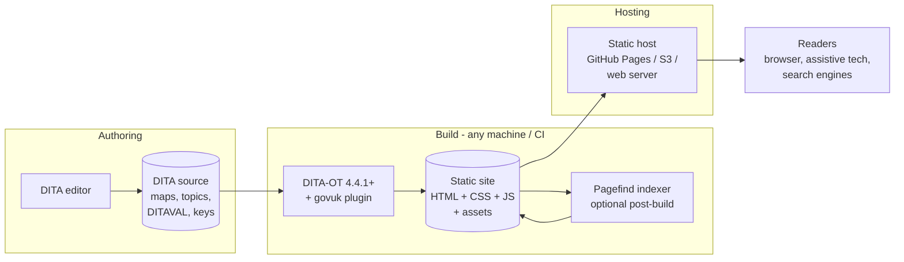

# 01 — Context and goals

## Background

Publications are currently authored in DITA and published with a **commercial HTML-help
transformation** bundled with the DITA editing toolchain. That works, but it ties the pipeline
to a commercial licence, and its visual language is the vendor's, not the UK government's. The
aim is a publishing route where a
DITA map goes **straight from the DITA Open Toolkit to a static website styled with the GOV.UK
Design System**, suitable for standards-style publications (ContSys, FHIR-related material,
Open Referral UK and similar) and, when configured for it, for genuine GOV.UK services.

The current commercial output remains **an input to the design** — it demonstrates the market
need and defines the feature baseline readers expect — but it is explicitly **not part of the
architecture**: nothing in the new pipeline may depend on any commercial product, its
transformations, or its assets.

## Goals

1. A single-command build: `dita --input=map.ditamap --format=govuk` produces a complete,
   self-contained static site.
2. Output that is recognisably the GOV.UK Design System: its components, typography scale,
   grid, and accessibility behaviour.
3. An **open** plugin: Apache-2.0 licensed, on GitHub, installable with `dita install` via the
   DITA-OT plugin registry, usable by anyone publishing DITA.
4. Feature parity with the parts of the current commercial output the publications actually use: navigable table of
   contents, search, index, and responsive layout.
5. Legally safe defaults: no crown logo or GDS Transport font unless the publisher is an
   official GOV.UK service and switches them on.

## Non-goals

- **No commercial-product involvement** — no vendor transtype as a base, no post-processing of
  vendor output, no reuse of vendor assets, stylesheets, or scripts.
- **No PDF output** — existing PDF routes are unaffected and out of scope.
- **No authoring features** — the plugin does not change how DITA is written or validated.
- **No server-side runtime** — output is purely static files; no CMS, no dynamic search
  backend, no analytics service (analytics hooks are a roadmap item, off by default).
- **No Node.js at build time** — the core build must run with DITA-OT + Java alone
  (the optional Pagefind step uses a self-contained binary; see [03-architecture.md](03-architecture.md)).

## Constraints

| # | Constraint | Consequence |
|---|---|---|
| C1 | GDS Transport font and the crown are licensed only for official GOV.UK services | Branding must default off; assets copied into output only when explicitly enabled |
| C2 | UK public-sector accessibility regulations; GOV.UK Frontend targets WCAG 2.2 AA | The plugin must not undermine the accessibility govuk-frontend provides; custom markup must meet the same bar |
| C3 | Target DITA-OT 4.4.1 or later (the latest release when pinned — D-11) | XSLT 3.0/Saxon available; must use only documented extension points to survive minor upgrades |
| C4 | Static hosting (GitHub Pages, S3, plain web server) | No server-side includes; search must be client-side; relative links throughout |
| C5 | govuk-frontend evolves (v5.x line) | Pin an exact vendored release; upgrading is a deliberate, tested change |

## Prior art

| Project | What it proves / what we take from it |
|---|---|
| **`org.dita.html5`** (DITA-OT built-in) | The base transtype we extend. Provides preprocessing, keyref/conref resolution, DITAVAL filtering, chunking, per-page navigation generation |
| **`net.infotexture.dita-bootstrap`** | An existing open plugin that extends `html5` and swaps in the Bootstrap design system. Direct proof that the chosen architecture works; a structural reference for plugin layout and extension-point use |
| **GDS Technical Documentation Template** | The layout and UX reference: persistent left-hand navigation, "on this page" contents, search in the header. Used by many UK government technical docs sites |
| **x-govuk `govuk-eleventy-plugin`** | Shows how the Design System is applied to documentation sites outside a Rails stack; a reference for neutral-branding practice and component selection |
| **Current commercial help output** | Evidence of market need and the feature baseline only — see parity table below. No vendor code or assets are reused |

## Feature parity with the current commercial output

What the current commercial help output provides today, and where each feature lands in this
design:

| Current-output feature | Disposition | Where |
|---|---|---|
| TOC sidebar with expand/collapse | **Kept** — tech-docs-style sidebar built from the map | FR-N1–N4 |
| Full-text search | **Kept** — Pagefind, post-build | FR-S1–S4 |
| Index terms page | **Kept** — v1 requirement | FR-X1–X3 |
| Breadcrumbs | **Kept, optional** — off by default in the sidebar layout | FR-N6 |
| Previous/next topic links | **Kept** — GOV.UK pagination component | FR-N5 |
| Responsive/mobile layout | **Kept** — govuk grid + mobile navigation | FR-N4, NFR-A* |
| Print-friendly CSS | **Deferred** — roadmap | Roadmap R3 |
| Search-term highlighting in results | **Deferred** — depends on Pagefind capabilities | Roadmap R4 |
| Rating / feedback widget | **Dropped** — replaced (optionally) by GOV.UK "is this page useful" pattern later | Roadmap R6 |
| PDF link integration | **Dropped** — out of scope | Non-goal |

## System context

Authoring stays exactly as it is — the same DITA source, edited in any DITA editor. Only the
publishing leg changes: DITA-OT with this plugin replaces the commercial transformation.
