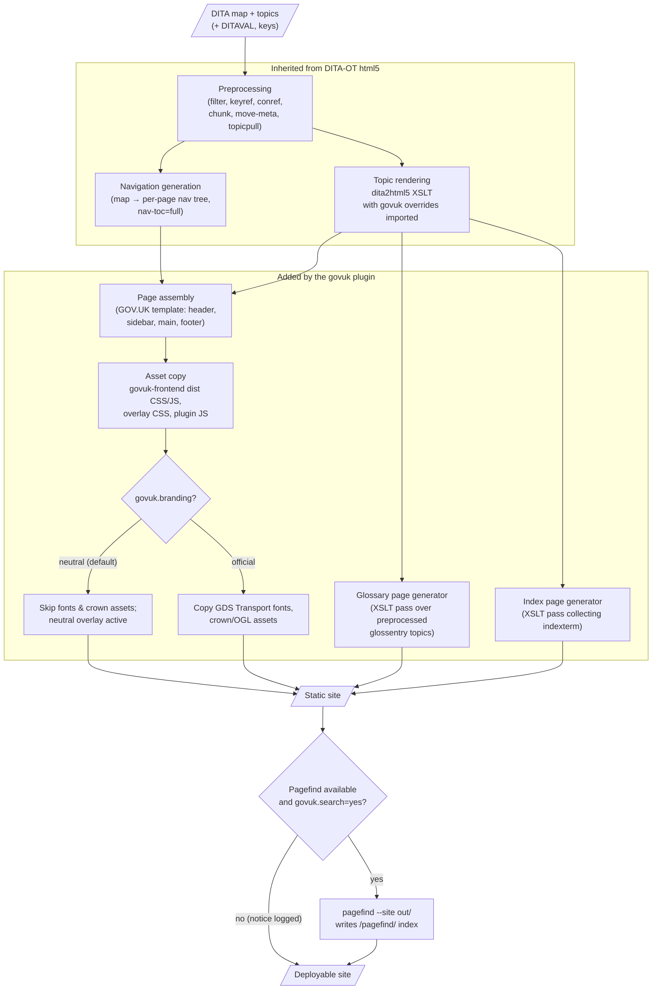
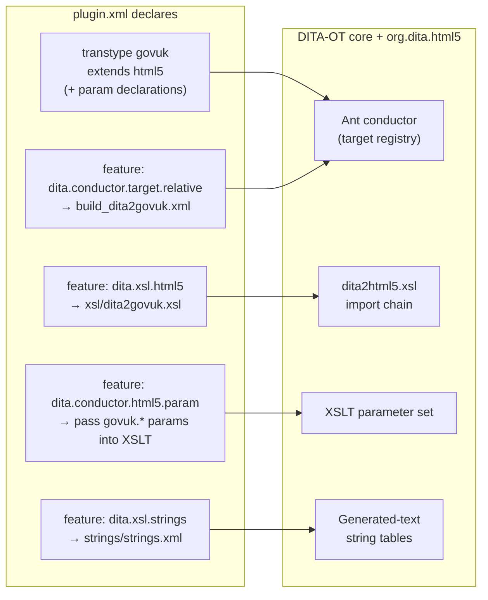

# 03 — Architecture

## Overview

The plugin is a **standard DITA-OT extension plugin** whose transtype `govuk` extends the
built-in `org.dita.html5`. It changes *what the HTML looks like* — templates, classes,
page furniture, assets — while inheriting *how DITA is processed* (preprocessing, key/conref
resolution, filtering, chunking, link management) unchanged from the toolkit. Two generators
(glossary, index) and one optional post-build step (Pagefind) are added around the inherited
pipeline.

This is the same architectural pattern proven by `net.infotexture.dita-bootstrap`.

## Build pipeline



Key property: everything left of the `govuk` subgraph is upstream DITA-OT behaviour we do not
fork. If a future DITA-OT release changes preprocessing, we inherit the fix.

## Plugin anatomy

Plugin ID **`org.istanduk.gov-uk`** (decided — see
[05-decision-log.md](05-decision-log.md), D-10). Proposed layout:

```
org.istanduk.gov-uk/
├── plugin.xml                 # transtype declaration, extension-point features, parameters
├── integrator.xml             # hooks the plugin's Ant file into the toolkit at install time
├── build_dita2govuk.xml       # Ant: dita2govuk target — delegates to dita2html5, then
│                              #   glossary/index generation, asset copy, Pagefind step
├── xsl/
│   ├── dita2govuk.xsl         # shell: imports html5 XSLT then the modules below
│   ├── template.xsl           # page skeleton: <html> … govuk-template, header, footer,
│   │                          #   width container, grid (sidebar + main), skip link
│   ├── nav.xsl                # sidebar tree markup + "on this page" contents
│   ├── blocks.xsl             # p, ul/ol, note, codeblock, fig, pre, lq …
│   ├── tables.xsl             # table/simpletable → govuk-table
│   ├── inline.xsl             # xref/link → govuk-link, term/abbreviated-form → abbr, ph, uicontrol …
│   ├── task.xsl               # steps, cmd, stepresult styling
│   ├── glossary.xsl           # standalone pass: glossary.html
│   ├── index.xsl              # standalone pass: index page from indexterm collection
│   └── home.xsl               # site home page from map metadata
├── resource/
│   ├── govuk-frontend/        # vendored pinned release (dist): *.min.css, *.min.js,
│   │   └── assets/            #   images, fonts (fonts copied only when branding=official)
│   ├── overlay-neutral.css    # neutral branding: system font stack, plain header colours
│   ├── plugin.css             # styles for plugin-specific furniture (sidebar tree, index page)
│   └── plugin.js              # nav expand/collapse init, govuk-frontend initAll(), search box wiring
├── search/
│   └── search.xsl / page      # search page shell + Pagefind UI integration
├── strings/
│   ├── strings.xml            # language registry
│   └── strings-en-gb.xml      # generated-text: "Contents", "Warning", "Search", "Menu", …
├── LICENSE                    # Apache-2.0 (+ MIT notice for vendored govuk-frontend)
└── docs/                      # user guide — authored in DITA, published with the plugin itself
```

## Extension-point wiring

The plugin touches the toolkit **only** through documented extension points
(exact IDs to be re-verified against the pinned DITA-OT release at implementation start —
they occasionally gain/lose entries between minors):



Because `dita.xsl.html5` *imports* our stylesheet into the standard chain with higher import
precedence, any element we don't override keeps its default html5 rendering — a safety net for
uncommon DITA elements.

## Page template

Every generated page follows the GOV.UK page template adapted to the tech-docs layout:

```mermaid
flowchart TD
    subgraph page["Page: html.govuk-template … body"]
        SKIP["Skip link — 'Skip to main content'"]
        HDR["Header<br/>neutral: plain bar + service name<br/>official: GOV.UK header with crown"]
        SVC["Service navigation row (optional)<br/>+ search field when search enabled"]
        PHASE["Phase banner (optional: alpha/beta)"]
        subgraph width["govuk-width-container → govuk-grid-row"]
            subgraph side["one-third / sidebar column"]
                NAVT["nav: map tree<br/>current page highlighted,<br/>JS expand/collapse"]
            end
            subgraph mainc["two-thirds / content column — main id='main-content'"]
                LEAD["h1 + shortdesc lead"]
                OTP["'On this page' contents (FR-N3)"]
                BODY["Topic body — mapped elements<br/>(see 04-components.md)"]
                REL["Related content"]
                PAG["Prev/next pagination"]
            end
        end
        FTR["Footer<br/>neutral: configurable links + copyright line<br/>official: OGL + crown copyright"]
    end
    SKIP --> HDR --> SVC --> PHASE --> width --> FTR
```



Implementation notes:

- The `<body>` opens with the standard govuk-frontend snippet that adds `js-enabled` /
  `govuk-frontend-supported` classes, and ends with `type="module"` script that runs
  `initAll()` plus the plugin's nav/search wiring.
- The sidebar renders the **full** tree on every page (`nav-toc=full` behaviour inherited from
  html5), so the no-JS experience is complete; JS collapses distant branches on load. For very
  large maps this bloats every page — mitigation on the roadmap (partial tree + fetch).
- One `h1` per page; DITA section titles map to `h2` and below to keep hierarchy valid.

## Build parameters (initial set)

| Parameter | Values / default | Purpose |
|---|---|---|
| `govuk.branding` | `neutral` (default) \| `official` | FR-T1/T2 — crown, fonts, OGL footer |
| `govuk.service.name` | text; default map title | Header service/publication name |
| `govuk.service.url` | URL; default site home | Header name link target |
| `govuk.phase` | `none` (default) \| `alpha` \| `beta` | Phase banner |
| `govuk.phase.feedback.url` | URL | Phase banner feedback link |
| `govuk.search` | `auto` (default) \| `yes` \| `no` | Search UI + Pagefind step; `auto` = on if Pagefind found |
| `govuk.pagefind.cmd` | path; default `pagefind` on PATH | Locate the Pagefind binary |
| `govuk.breadcrumbs` | `no` (default) \| `yes` | FR-N6 |
| `govuk.footer.links` | file/ref | Footer link list (title+URL pairs) |
| `govuk.footer.licence` | text/HTML ref | Neutral-mode licence statement |
| `govuk.favicon` | path | Custom favicon set |
| `args.css`, `args.cssroot`, `args.copycss` | inherited | Publisher CSS appended last (FR-T4) |

## Search architecture

Pagefind was chosen (see decision log) because it indexes the *rendered output*, needs no
build-time integration with XSLT, ships as a self-contained binary, and its UI is a small
self-hosted JS/CSS bundle — consistent with the no-CDN rule.

- The Ant `govuk.search` step runs after all HTML is written: `pagefind --site <outdir>`.
  Output lands in `<outdir>/pagefind/` alongside the site.
- Page markup scopes indexing with `data-pagefind-body` on `<main>` so navigation and page
  furniture never pollute results (FR-S3).
- The search page loads Pagefind's UI bundle *from the site itself*; the plugin restyles it
  with Design System form/typography classes.
- Absence handling (FR-S4): if the binary is missing and `govuk.search=auto`, the build logs a
  notice and emits the site without the search field. `govuk.search=yes` with no binary is a
  build **error**, because the publisher explicitly asked for search.

## Branding architecture

Neutral by default; official on request. The two modes differ in three places only:

1. **Assets copied** — fonts and crown/OGL imagery are copied into the output only in
   official mode. In neutral mode nothing references them, so nothing 404s.
2. **Overlay stylesheet** — `overlay-neutral.css` loads after `govuk-frontend.min.css` and
   re-declares the font stack (system fonts) so `GDS Transport` is never requested, and
   restyles the header bar to a plain dark bar without the crown. Official mode omits the
   overlay. (We override the compiled CSS rather than recompiling Sass — the cost of the
   vendored-dist decision, kept small by limiting overrides to fonts and header/footer.)
3. **Template branches** — header and footer XSLT templates branch on `govuk.branding`:
   neutral emits service name only and a configurable footer; official emits the GOV.UK
   header with crown logotype and the OGL/crown-copyright footer.

CI asserts the neutral build's output contains no font files, no crown assets, and no request
for either (NFR-M2 snapshot + a simple grep-style check).

## Glossary and index generation

Both run as **additional XSLT passes in the Ant target**, reading the *preprocessed* temp
files (keys and conrefs already resolved) rather than raw source:

- **Glossary** — collect `glossentry` topics referenced by the map, sort per collation
  (en-GB), group by initial letter, emit `glossary.html` with letter navigation. Topic-body
  occurrences of `abbreviated-form`/`term` link into it (handled in `inline.xsl`).
- **Index** — collect `indexterm` elements with their nearest page + anchor, merge duplicates,
  nest sub-terms, emit an A–Z `index-page.html` (name avoids colliding with a site `index.html`).
  `index-see`/`see-also` render as cross-references.

Neither exists in the html5 base, so these are the plugin's largest pieces of genuinely new
processing logic — sized accordingly in the component inventory.

## Risks and mitigations

| Risk | Likelihood / impact | Mitigation |
|---|---|---|
| govuk-frontend markup contracts change between releases (components require exact structure/classes) | Medium / High | Pin the vendored release (NFR-M2); visual-regression + axe snapshots on upgrade; keep component markup in few, focused XSLT modules |
| DITA-OT html5 internals shift between 4.x minors | Medium / Medium | Only documented extension points (NFR-M1); CI matrix across supported 4.x releases with a fixture publication |
| Full nav tree on every page bloats output for very large maps | Medium / Medium | Accept for v1 (typical standards pubs are hundreds of topics, not tens of thousands); roadmap: partial tree + JSON fetch |
| Neutral-mode CSS overlay drifts from the compiled dist as govuk-frontend evolves | Medium / Low | Keep the overlay minimal (fonts + header/footer only); CI check that no font/crown asset is referenced |
| Pagefind availability varies across environments | High / Low | `auto` mode with graceful skip (FR-S4); document binary install; consider bundling per-OS binaries later |
| Index/glossary logic has no upstream reference implementation in html5 | Certain / Medium | Treat as first-class components with their own fixtures and tests; PDF plugin's index behaviour is the semantic reference |
| Legal misuse: someone flips `govuk.branding=official` without being a GOV.UK service | Low / High (reputational) | Prominent documentation + build-time warning banner in the log when official mode is enabled |
