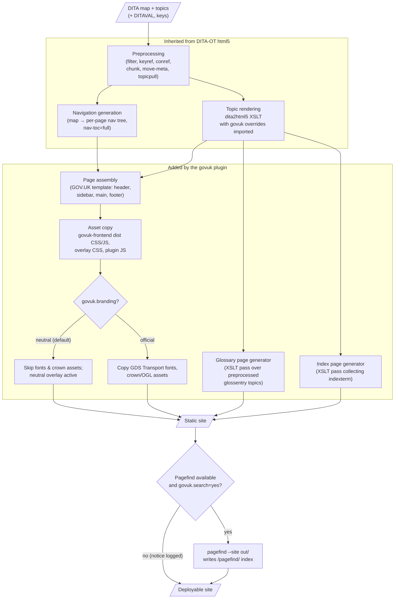
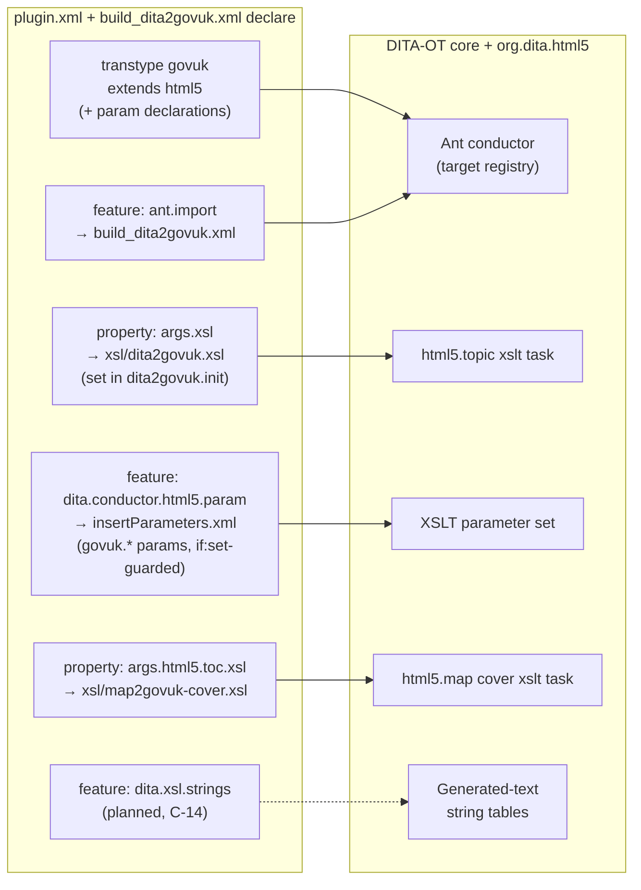

# 03 — Architecture

## Overview

The plugin is a **standard DITA-OT extension plugin** whose transtype `govuk` extends the
built-in `org.dita.html5`. It changes *what the HTML looks like* — templates, classes,
page furniture, assets — while inheriting *how DITA is processed* (preprocessing, key/conref
resolution, filtering, chunking, link management) unchanged from the toolkit. Two generators
(glossary, index) and one optional post-build step (Pagefind) are added around the inherited
pipeline.

This is the same architectural pattern proven by `net.infotexture.dita-bootstrap`.

## Build pipeline



Key property: everything left of the `govuk` subgraph is upstream DITA-OT behaviour we do not
fork. If a future DITA-OT release changes preprocessing, we inherit the fix.

## Plugin anatomy

Plugin ID **`org.istanduk.gov-uk`** (decided — see
[05-decision-log.md](05-decision-log.md), D-10). **As built at v0.1.0** — the implementation
consolidated the proposed rendering modules into fewer files (`blocks.xsl` carries typography,
tables, notes, and SVG handling; the cover stylesheet replaced the proposed `home.xsl`), and
the glossary/index/search/strings pieces remain planned:

```
org.istanduk.gov-uk/
├── plugin.xml                 # transtype govuk extends html5; params; ant.import +
│                              #   dita.conductor.html5.param features
├── build_dita2govuk.xml       # Ant: dita2govuk = init (args.xsl, cover xsl, nav-toc,
│                              #   branding guard) → dita2html5 → asset copy
├── insertParameters.xml       # passes govuk.* Ant properties into the topic XSLT
├── xsl/
│   ├── dita2govuk.xsl         # shell: imports html5 chain, then template + blocks
│   ├── template.xsl           # page skeleton: govuk-template, masthead, grid
│   │                          #   (sidebar + main), footer, CSS links, scripts
│   ├── blocks.xsl             # typography via set-output-class; notes → inset/warning;
│   │                          #   tables incl. spans; svgref alt; captions
│   └── map2govuk-cover.xsl    # GOV.UK home page: title, bookmap abstract,
│   │                          #   attribution, contents tree (args.html5.toc.xsl)
│   └── utility-pages.xsl      # glossary + index harvest and A–Z pages (FR-G, FR-X)
├── resource/
│   ├── govuk-frontend/        # vendored v6.5.0 compiled CSS/JS + maps, VERSION,
│   │                          #   LICENSE, NOTICE — no fonts or crown imagery
│   ├── css/
│   │   ├── overlay-neutral.css  # neutral branding: local font aliasing, crest suppression
│   │   └── plugin.css           # masthead, sidebar, contents, figures, code, links
│   └── js/
│       └── plugin.js          # menu toggle, caret collapse, chunked-page highlight
└── strings/                   # generated-text registry + strings-en-gb.xml (NFR-I1)
```

Search (FR-S) needed no directory of its own: the Ant init probes for Pagefind and the
`govuk.search-index` target runs it post-build; the search page is emitted by the cover
stylesheet via `xsl:result-document`.

The repository root carries `LICENSE` (Apache-2.0) and the design docs; the vendored MIT
licence and NOTICE live beside the govuk-frontend assets.

## Extension-point wiring

The plugin touches the toolkit **only** through documented extension points and properties.
Verified against DITA-OT 4.4.1, the as-built wiring differs from the original sketch in one
useful way: instead of the global `dita.xsl.html5` extension point (which would inject our
XSLT into *every* html5-family transtype), the `dita2govuk.init` target sets the **`args.xsl`
property**, scoping all overrides to the `govuk` transtype — plain `html5` builds on the same
toolkit are untouched. The cover page is routed the same way via **`args.html5.toc.xsl`**.



Because `dita2govuk.xsl` *imports* the standard html5 chain first and the plugin's modules
after it (higher import precedence), any element we don't override keeps its default html5
rendering — a safety net for uncommon DITA elements, proven in practice by the ORUK corpus
(design/07). The one subtlety found during implementation: element classes are appended
through the `set-output-class` mode (the hook `commonattributes` actually uses), so an
author's `@outputclass` still replaces the plugin's default classes per element.

## Page template

Every generated page follows the GOV.UK page template adapted to the tech-docs layout:

```mermaid
flowchart TD
    subgraph page["Page: html.govuk-template … body"]
        SKIP["Skip link — 'Skip to main content'"]
        HDR["Header<br/>neutral: plain bar + service name<br/>official: GOV.UK header with crown"]
        SVC["Service navigation row (optional)<br/>+ search field when search enabled"]
        PHASE["Phase banner (optional: alpha/beta)"]
        subgraph width["govuk-width-container → govuk-grid-row"]
            subgraph side["one-third / sidebar column"]
                NAVT["nav: map tree<br/>current page highlighted,<br/>JS expand/collapse"]
            end
            subgraph mainc["two-thirds / content column — main id='main-content'"]
                LEAD["h1 + shortdesc lead"]
                OTP["'On this page' contents (FR-N3)"]
                BODY["Topic body — mapped elements<br/>(see 04-components.md)"]
                REL["Related content"]
                PAG["Prev/next pagination"]
            end
        end
        FTR["Footer<br/>neutral: configurable links + copyright line<br/>official: OGL + crown copyright"]
    end
    SKIP --> HDR --> SVC --> PHASE --> width --> FTR
```



Implementation notes:

- The `<body>` opens with the standard govuk-frontend snippet that adds `js-enabled` /
  `govuk-frontend-supported` classes, and ends with `type="module"` script that runs
  `initAll()` plus the plugin's nav/search wiring.
- The sidebar renders the **full** tree on every page (`nav-toc=full` behaviour inherited from
  html5), so the no-JS experience is complete; JS collapses distant branches on load. For very
  large maps this bloats every page — mitigation on the roadmap (partial tree + fetch).
- One `h1` per page; DITA section titles map to `h2` and below to keep hierarchy valid.

## Build parameters (initial set)

Status as of v0.1.0: ✅ implemented · ⬜ planned (each arrives with its feature).

| Parameter | Values / default | Purpose | Status |
|---|---|---|---|
| `govuk.branding` | `neutral` (default) \| `istanduk` \| `official` | FR-T1/T2 — crown, fonts, OGL footer; `istanduk` layers the iStandUK theme (D-14) on neutral | ✅ neutral + istanduk; `official` warns and is not yet implemented |
| `govuk.service.name` | text; default map/book title | Masthead service/publication name | ✅ |
| `govuk.service.url` | URL; default site home | Masthead link target | ⬜ (masthead links to `index.html`) |
| `govuk.phase` | `none` (default) \| `alpha` \| `beta` | Phase banner | ⬜ |
| `govuk.phase.feedback.url` | URL | Phase banner feedback link | ⬜ |
| `govuk.search` | `auto` (default) \| `yes` \| `no` | Search UI + Pagefind step; `auto` = on if Pagefind found | ✅ |
| `govuk.pagefind.cmd` | path; default `pagefind` on PATH | Locate the Pagefind binary | ✅ |
| `govuk.homepage.layout` | `auto` (default) \| `start` \| `annotated` \| `list` \| `grid` \| `grouped` \| `accordion` | D-13 — landing-page layout; `auto` selects from map shape | ✅ |
| `govuk.homepage.depth` | 1–9; default `2` | Levels of the map shown by the grid/grouped/accordion/start layouts (1 = entries only; 2 = + children; 3+ nest) | ✅ |
| `govuk.pagination` | `yes` (default) \| `no` | FR-N5 — previous/next block pagination in reading order | ✅ |
| `govuk.breadcrumbs` | `no` (default) \| `yes` | FR-N6 | ⬜ |
| `govuk.footer.links` | file/ref | Footer link list (title+URL pairs) | ⬜ |
| `govuk.footer.licence` | text/HTML ref | Neutral-mode licence statement | ⬜ |
| `govuk.favicon` | path | Custom favicon set | ⬜ |
| `args.css`, `args.cssroot`, `args.copycss` | inherited | Publisher CSS appended last (FR-T4) | ✅ |

## Search architecture

Pagefind was chosen (see decision log) because it indexes the *rendered output*, needs no
build-time integration with XSLT, ships as a self-contained binary, and its UI is a small
self-hosted JS/CSS bundle — consistent with the no-CDN rule.

- The Ant `govuk.search` step runs after all HTML is written: `pagefind --site <outdir>`.
  Output lands in `<outdir>/pagefind/` alongside the site.
- Page markup scopes indexing with `data-pagefind-body` on `<main>` so navigation and page
  furniture never pollute results (FR-S3).
- The search page loads Pagefind's UI bundle *from the site itself*; the plugin restyles it
  with Design System form/typography classes.
- Absence handling (FR-S4): if the binary is missing and `govuk.search=auto`, the build logs a
  notice and emits the site without the search field. `govuk.search=yes` with no binary is a
  build **error**, because the publisher explicitly asked for search.

## Branding architecture

Neutral by default; official on request. The two modes differ in three places only:

1. **Assets copied** — fonts and crown/OGL imagery are copied into the output only in
   official mode. In neutral mode nothing references them, so nothing 404s.
2. **Overlay stylesheet** — `overlay-neutral.css` loads after `govuk-frontend.min.css` and
   re-declares the font stack (system fonts) so `GDS Transport` is never requested, and
   restyles the header bar to a plain dark bar without the crown. Official mode omits the
   overlay. (We override the compiled CSS rather than recompiling Sass — the cost of the
   vendored-dist decision, kept small by limiting overrides to fonts and header/footer.)
3. **Template branches** — header and footer XSLT templates branch on `govuk.branding`:
   neutral emits service name only and a configurable footer; official emits the GOV.UK
   header with crown logotype and the OGL/crown-copyright footer.

CI asserts the neutral build's output contains no font files, no crown assets, and no request
for either (NFR-M2 snapshot + a simple grep-style check).

## Glossary and index generation

As built, both are **harvested during the cover transformation** (`utility-pages.xsl`) rather
than as separate Ant passes: the normalised map supplies the reading structure and output
paths, and `document()` loads each referenced *preprocessed* topic once (keys and conrefs
already resolved) to collect content. Both pages are emitted with `xsl:result-document` and
appear only when their source markup exists.

- **Glossary** — every `glossentry` topic referenced by the map (resource-only keydefs
  included) is collected, sorted with en-GB collation, grouped by initial letter, and emitted
  as `glossary.html` with letter navigation, showing term, acronym, and definition linked to
  the entry's own page. `abbreviated-form`/`term` references link to those entry pages with
  first-use expansion semantics inherited from the toolkit.
- **Index** — `indexterm` elements are collected per rendered page with the containing
  topic's anchor, merged case-insensitively, nested one level, and emitted as
  `index-page.html` (name avoids colliding with the site `index.html`);
  `index-see`/`index-see-also` render as "see …" / "see also …" lines.

Sidebar links to both pages are switched by a build-time source scan (the pages themselves
are generated from the resolved map, which is definitive). Neither generator exists in the
html5 base — they are the plugin's largest pieces of genuinely new processing logic.

## Risks and mitigations

| Risk | Likelihood / impact | Mitigation |
|---|---|---|
| govuk-frontend markup contracts change between releases (components require exact structure/classes) | Medium / High | Pin the vendored release (NFR-M2); visual-regression + axe snapshots on upgrade; keep component markup in few, focused XSLT modules |
| DITA-OT html5 internals shift between 4.x minors | Medium / Medium | Only documented extension points (NFR-M1); CI matrix across supported releases (4.4.1 upward) with a fixture publication |
| Full nav tree on every page bloats output for very large maps | Medium / Medium | Accept for v1 (typical standards pubs are hundreds of topics, not tens of thousands); roadmap: partial tree + JSON fetch |
| Neutral-mode CSS overlay drifts from the compiled dist as govuk-frontend evolves | Medium / Low | Keep the overlay minimal (fonts + header/footer only); CI check that no font/crown asset is referenced |
| Pagefind availability varies across environments | High / Low | `auto` mode with graceful skip (FR-S4); document binary install; consider bundling per-OS binaries later |
| Index/glossary logic has no upstream reference implementation in html5 | Certain / Medium | Treat as first-class components with their own fixtures and tests; PDF plugin's index behaviour is the semantic reference |
| Legal misuse: someone flips `govuk.branding=official` without being a GOV.UK service | Low / High (reputational) | Prominent documentation + build-time warning banner in the log when official mode is enabled |
