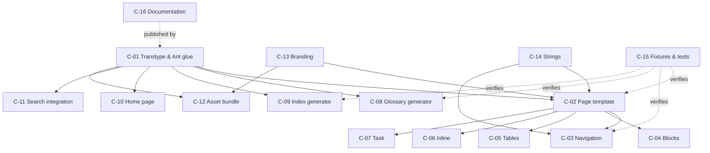

# 04 — Components

Three views: the **plugin component inventory** (what we build), the **DITA → GOV.UK mapping**
(what the XSLT emits), and the **traceability matrix** (which component satisfies which
requirement from [02-requirements.md](02-requirements.md)).

## Component inventory

Status as of **v0.1.0**: ✅ implemented · 🔶 partly implemented · ⬜ not started. Note the
as-built file layout consolidated several proposed modules — tables, inline, and SVG handling
live in `blocks.xsl`, and the home page is `map2govuk-cover.xsl` (see
[03-architecture.md](03-architecture.md), plugin anatomy).

| ID | Component | Description | Size* | Status |
|---|---|---|---|---|
| C-01 | **Transtype & Ant glue** | `plugin.xml` (transtype `govuk` extends `html5`, parameter declarations), `insertParameters.xml`, `build_dita2govuk.xml` orchestrating: delegate to `dita2html5` → glossary pass → index pass → asset copy → branding branch → Pagefind step | S | ✅ core (glossary/index/Pagefind steps arrive with C-08/C-09/C-11) |
| C-02 | **Page template module** | `template.xsl` — GOV.UK page skeleton (skip link, header, service row, phase banner, grid, footer), `js-enabled` snippet, module script block, metadata head | M | ✅ (phase banner pending FR-T3) |
| C-03 | **Navigation module** | sidebar tree from inherited nav output (restyled in `template.xsl`/`plugin.css`) + `plugin.js` — current-page highlighting (chunked pages included), expand/collapse enhancement, mobile menu toggle, "On this page" contents, prev/next pagination, optional breadcrumbs | L | 🔶 sidebar, highlighting, menu, carets done; "On this page" (FR-N3), prev/next (FR-N5), breadcrumbs (FR-N6) pending |
| C-04 | **Block rendering module** | `blocks.xsl` — paragraphs, lists, notes→inset/warning, codeblocks, figures, quotes, section titles/heading levels | M | ✅ |
| C-05 | **Table module** | CALS `table` and `simpletable` → `govuk-table` (in `blocks.xsl`), captions, header scoping, column spans, overflow wrapper | M | ✅ |
| C-06 | **Inline module** | links (`xref` → `govuk-link`), `term`/`abbreviated-form` → `<abbr>` + glossary link, `ph`, `uicontrol`/`menucascade`, `cite`, `fn` markers | M | 🔶 xref done; glossary-linked inline and UI-domain styling pending |
| C-07 | **Task module** | steps as numbered lists, cmd/info/stepresult styling, prereq/context/result sections | S | ⬜ inherited rendering only |
| C-08 | **Glossary generator** | `utility-pages.xsl` (harvested in the cover pass) — collect referenced `glossentry` topics, en-GB collation sort, A–Z page with letter nav | M | ✅ |
| C-09 | **Index generator** | `utility-pages.xsl` (harvested in the cover pass) — collect `indexterm` with page+anchor locators, merge, nest, see/see-also, A–Z page | L | ✅ |
| C-10 | **Home page generator** | `map2govuk-cover.xsl` — site landing page from map/bookmap title, abstract, attribution, and contents; D-13 layouts (start/annotated/grouped auto-selected; list/grid/accordion overrides) | S | ✅ |
| C-11 | **Search integration** | Ant Pagefind step with auto/yes/no logic, search page shell, `data-pagefind-body` scoping, self-hosted Pagefind UI restyled with Design System form classes | M | ✅ |
| C-12 | **Asset bundle** | Vendored pinned `govuk-frontend` dist (v6.5.0, CSS/JS only — no restricted assets), `overlay-neutral.css`, `plugin.css`, `plugin.js` | M | ✅ |
| C-13 | **Branding module** | `govuk.branding` parameter handling: template branches (header/footer variants), conditional asset copy (fonts, crown, OGL), build-log warning in official mode | M | 🔶 neutral mode, the iStandUK theme (D-14), and the official-mode warning done; official mode itself pending (FR-T2) |
| C-14 | **Localisation strings** | `strings.xml` + `strings-en-gb.xml` for all generated text; wired to the toolkit's generated-text mechanism | S | ✅ (JavaScript labels passed via data attributes; further locales are additive files) |
| C-15 | **Fixture publication & test harness** | Sample DITA publications exercising the mapped elements (CI subjects); HTML validation (Nu), axe-core accessibility checks, visual-regression snapshots, DITA-OT version matrix, neutral-mode asset assertions | L | 🔶 two fixtures, Nu validation, structural and asset assertions in CI; axe, visual regression, and version matrix pending |
| C-16 | **Documentation** | User guide (install, parameters, branding rules and the legal position, search setup, theming) — authored in DITA and published with the plugin itself as its live demo | M | 🔶 manual authored as a DITA bookmap in `docs/manual/` (getting started, reference, capability demonstrations, development), built and asserted in CI as the primary fixture; search/theming sections arrive with their features |

\* Relative effort: S = small, M = medium, L = large.

## DITA element → GOV.UK Design System mapping

The contract for C-04…C-07 and the fixture in C-15. Elements not listed fall through to the
inherited html5 rendering (styled acceptably by base typography rules).

### Structure and typography

| DITA | GOV.UK rendering |
|---|---|
| topic `title` | `h1.govuk-heading-l` (`-xl` on the home page) |
| `shortdesc` / `abstract` first para | `p.govuk-body-l` lead paragraph |
| `section/title` | `h2.govuk-heading-m` |
| nested `topic` titles / deeper sections | `h3.govuk-heading-s`, then `h4` |
| `p` | `p.govuk-body` |
| `ul` | `ul.govuk-list.govuk-list--bullet` |
| `ol` | `ol.govuk-list.govuk-list--number` |
| `sl` | `ul.govuk-list` |
| `dl` | `dl.govuk-summary-list` (definition pairs) or styled `dl` where summary-list semantics don't fit |
| `lq` | `blockquote` with inset-text styling |
| `codeblock` / `pre` | `<pre><code>` monospace block, x-govuk-style code styling, horizontal scroll (v1: no highlighting) |
| `codeph` / `filepath` / `apiname` | inline `<code>` |
| `fig` + `image` | `<figure>` with `<figcaption>`, image `max-width:100%`, alt preserved |

### Notes and admonitions

| DITA `note/@type` | GOV.UK component |
|---|---|
| (none), `note`, `tip`, `remember`, `other` | **Inset text** (`govuk-inset-text`) |
| `important`, `attention` | **Warning text** (`govuk-warning-text`) |
| `warning`, `caution`, `danger`, `notice` | **Warning text**, generated label from strings (C-14) |
| `trouble` | Inset text with "Troubleshooting" label |

### Tables

| DITA | GOV.UK rendering |
|---|---|
| `table` (CALS) | `table.govuk-table`; `title` → `caption.govuk-table__caption`; `thead` cells → `th.govuk-table__header` with `scope`; wrapped in an overflow container |
| `simpletable` | same treatment; `sthead` → header row |
| `properties` (reference) | `govuk-table` with Property/Type/Description headers |

### Links and inline semantics

| DITA | GOV.UK rendering |
|---|---|
| `xref`, `link` | `a.govuk-link` (external links may add `rel="external"`) |
| related-links / reltable output | "Related content" section: `h2` + `govuk-list` of links |
| `term` (with glossary keyref) | link to glossary entry |
| `abbreviated-form` | `<abbr title="expansion">` linked to glossary entry |
| `uicontrol` | `<strong>` (bold per GDS style — sparing emphasis) |
| `menucascade` | uicontrols joined with "›" |
| `shortcut` / keyboard input | `<kbd>` styled inline code |
| `fn` | superscript marker → footnote list at page end |
| `draft-comment` (enabled builds) | highlighted inset box, clearly non-final |

### Task topics

| DITA | GOV.UK rendering |
|---|---|
| `prereq` | "Before you start" `h2` + body |
| `steps` | `ol.govuk-list.govuk-list--number.govuk-list--spaced` |
| `cmd` | step lead sentence |
| `info` / `stepxmp` | indented body under the step |
| `stepresult` | body text (result phrasing per GDS style) |
| `result` | "What happens next"-style closing section |

### Page furniture (map-driven)

| Source | GOV.UK component |
|---|---|
| map hierarchy | Sidebar navigation tree (tech-docs pattern) |
| map reading order | **Pagination** (block variant) prev/next |
| ancestor topicrefs | **Breadcrumbs** (optional, FR-N6) |
| page `h2`s | "On this page" contents list |
| `govuk.phase` param | **Phase banner** |
| `govuk.service.name` | Header / service navigation |
| glossary topics | A–Z glossary page |
| `indexterm`s | A–Z index page |
| Pagefind | Header search field + search page |
| bookmap `bookmeta` (bookrights, author, publisher) | Footer copyright line (`© years owner`) + attribution, on every page (#42) |

## Requirements traceability

| Requirement group | Satisfied by |
|---|---|
| FR-B1–B6 (build & integration) | C-01, C-15 (matrix CI for B5/B6) |
| FR-N1–N8 (navigation & layout) | C-03, C-02 (N7 skip link/landmarks), C-10 (N8) |
| FR-R1–R9 (rendering) | C-04 (R1–R5, R9), C-05 (R3), C-06 (R7 inline), C-07 (R6), C-02 (R8) |
| FR-G1–G4 (glossary) | C-08, C-06 (G2/G3 inline linking) |
| FR-X1–X3 (index) | C-09 |
| FR-S1–S4 (search) | C-11 |
| FR-T1–T5 (branding) | C-13, C-12 (T1 overlay), C-02 (T3 template params) |
| NFR-A1–A3 (accessibility, validity, no-JS) | C-02, C-03, C-12; verified by C-15 |
| NFR-P1–P2 (self-contained, weight) | C-12, C-11 (self-hosted search UI); verified by C-15 |
| NFR-V1–V2 (stable URLs, privacy) | C-01 (naming), C-12 (no trackers); verified by C-15 |
| NFR-I1 (localisable UI text) | C-14 |
| NFR-M1–M2 (maintainability, pinning) | C-01, C-12; verified by C-15 |
| NFR-L1 (licensing) | C-12 (attribution), repo licence files, C-16 (documented) |

Every requirement lands on at least one component; C-15 (fixtures & tests) is the verification
backstop for all of them.
