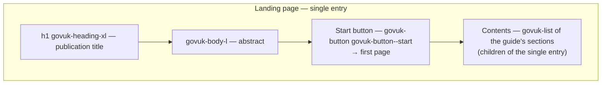
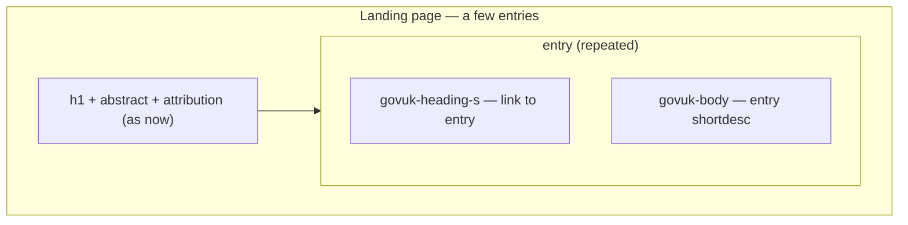
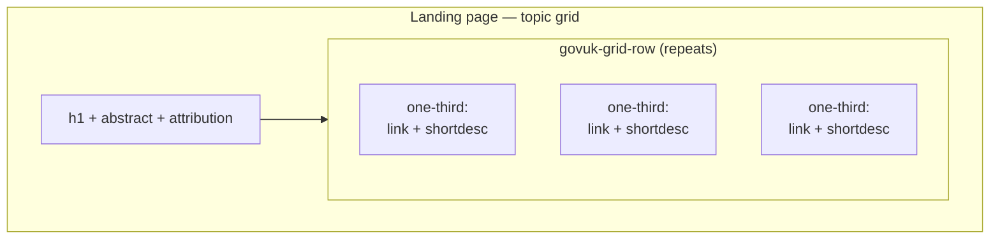
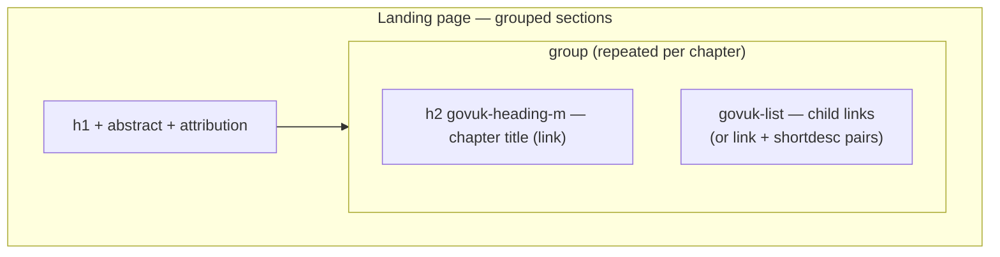

# Spike — landing-page layouts

**Status:** design spike, no code · **Date:** 2026-09-02 · **Feeds:** a future D-13 decision
and changes to `map2govuk-cover.xsl` (component C-10)

## Question

The v0.1.0 landing page renders title, abstract, attribution, and a plain contents tree. The
commercial help outputs we are replacing offer two landing styles — a list of top-level links,
or a tile grid. Which GOV.UK Design System components give a visually appealing, accessible
landing page when a publication has **one**, **a few**, or **many** top-level headings?

## What the cover generation has to work with

At cover time the plugin sees the whole (normalised) map, so every layout below can be built
from data we already have — no new preprocessing:

| Data | Source |
|---|---|
| Publication title | `mainbooktitle` / map `title` |
| Abstract | `booktitlealt` (bookmaps) |
| Attribution | `bookmeta` author / organization |
| Per entry: link text | `@navtitle` or target topic title |
| Per entry: description | target topic `shortdesc` (already pulled for `@title` tooltips on links) |
| Per entry: children | nested `topicref`s (count and depth) |
| Grouping | `chapter`/`part` structure in bookmaps |

## GDS component survey

Assessed against govuk-frontend **v6.5.0** (what we vendor — class availability verified in
the ORUK work) and GDS style guidance.

| Component / pattern | In v6.5.0? | Fit for a landing page | Notes |
|---|---|---|---|
| Typography + grid ("topic card" idiom) | ✅ (classes + grid) | **Strong** | How GOV.UK itself does "tiles": bold link + one-line description in `govuk-grid-column-one-third` columns. No boxes, no borders — scannable and accessible |
| `govuk-list` of links (current) | ✅ | Good baseline | What v0.1.0 ships; fine for a few entries, featureless for many |
| Link + description list ("annotated contents") | ✅ (typography) | **Strong** | Each entry: `govuk-heading-s` link + `govuk-body` shortdesc. The GOV.UK services-page idiom; scales 2–10 entries |
| **Start button** (`govuk-button--start`) | ✅ | **Strong for single-entry** | The GOV.UK guide pattern: hero text then one green "Start" action |
| Accordion | ✅ (JS component) | Good for very many | Collapses grouped sections; needs JS (degrades open); GDS advises accordions only when content genuinely overwhelms |
| Summary list / summary card | ✅ | Weak | Designed for key-value data review, not navigation |
| Tabs | ✅ | **Avoid** | GDS guidance: not for page-to-page navigation; hides content from scanning and search |
| Details | ✅ | Weak | Single-disclosure widget; an accordion does grouped disclosure better |
| Panel | ✅ | Avoid | Confirmation banner semantics (transaction complete), not decoration |
| Notification banner | ✅ | Situational | Good later for "not the latest version" (roadmap R2), not for navigation |
| Boxed tiles / cards | ❌ not in core | **Avoid as boxes** | Deliberately absent from the Design System; extended libraries (MoJ/x-govuk cards) exist but would add a dependency and GDS research favours link lists. The typography-grid idiom above delivers the "tile" scan-pattern without boxes |

The headline: GDS answers "tiles" with **typography in a grid**, not boxed cards — and it
answers "one big task" with a **Start button**. Both are already in our vendored CSS.

## Proposed layouts by cardinality

### L1 — Single entry: guide start (1 top-level heading)

The publication is really one linear guide. GOV.UK guide pattern: hero, then act.

Components: `govuk-button--start`, typography, `govuk-list`. Nothing new to vendor.

### L2 — A few entries: annotated contents (2–8 top-level headings)

Each top-level entry earns a description, pulled from its topic's `shortdesc` — information
the plain list throws away today.

Components: typography only. Single column, generous spacing (`govuk-section-break` between
entries optional). This is the GOV.UK organisation/services-page idiom.

### L3 — Several-to-many entries: topic grid (6–15)

The GDS-styled answer to the commercial tile grid: the same link + description pairs, flowed
into halves or thirds columns. Scan-friendly without boxes.

Components: grid + typography. Columns stack to single column on mobile for free. Rule of
thumb: thirds for 6+, halves for 4–5 so columns don't look sparse.

### L4 — Many entries with structure: grouped sections (bookmap chapters/parts, or 9+)

When the map has chapters (or simply many entries), group: an `h2` per chapter with its
entries beneath as an annotated or plain list — the GOV.UK topic-page idiom. Optionally each
group's list is the entry's *children* rather than the entries themselves.

Components: typography + lists; no JS. For ORUK's international bookmap (one chapter, ~90
visible entries) this collapses to L2/L3 within the single chapter.

### L5 — Very many entries: accordion contents (20+ ungrouped, or deep structure)

Same grouping as L4 but each group sits in a `govuk-accordion` section, so the page stays
short and the reader opens what they need. JS-dependent (degrades to all-open sections);
"show all sections" comes free with the component, which our `initAll()` already activates.

Components: `govuk-accordion` + lists. Reserve for genuinely overwhelming maps — GDS research
cautions against hiding content by default.

## Recommendation

1. **Default `auto` behaviour** in the cover generation, chosen from map shape:
   - 1 top-level entry → **L1 guide start**
   - 2–8 entries → **L2 annotated contents**
   - 9+ entries, or bookmap with multiple chapters/parts → **L4 grouped sections**
2. **`govuk.homepage.layout` parameter** to override: `auto | start | list | grid | grouped |
   accordion` (`list` = today's plain tree, kept for continuity). This extends the FR-N8/
   C-10 scope and the parameter table in 03-architecture.
3. **Adopt the typography-grid (L3) as the "tiles" answer** where a publisher asks for it —
   never boxed cards; stays inside core govuk-frontend, no new dependencies.
4. **Reserve the accordion (L5) as an explicit opt-in**, not an `auto` outcome.
5. Reuse `shortdesc` as the entry description everywhere — the single biggest visual upgrade
   over both the current page and the commercial outputs' bare link lists.

Accessibility notes: L1–L4 are pure HTML (no JS dependency), keep one `h1` and a logical
heading hierarchy, and inherit link/focus styling already validated. L5 relies on the
accordion's own (well-tested) ARIA; it degrades to open sections without JS.

## Next steps (post-spike)

- Review the five layouts — ideally against real maps: ORUK international (1 chapter, many
  entries), the combined-schemas bookmap, and a ContSys-style map.
- Record the layout decision as **D-13** in the decision log.
- Implement in `map2govuk-cover.xsl` (component C-10) with fixture coverage per layout, then
  update FR-N8's status and the 03-architecture parameter table.
